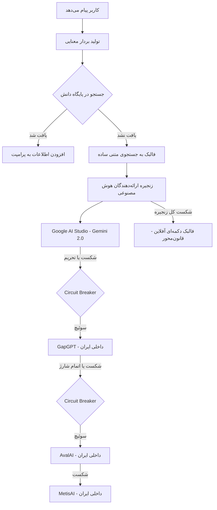

# 🪐 سند جامع و معمارانه اکوسیستم هوشک (Hoshak Ecosystem Master Blueprint)
### نسخه ۱.۰ | سند مرجع طراحی، توسعه فنی و هماهنگی استراتژیک پروژه‌ها
**بنیان‌گذار و ایده پرداز:** حسین حکمیان (H.H)
**برند تجاری محصولات:** آیناب (Ainaab)
**تاریخ تدوین:** ژوئن ۲۰۲۶

---

## ۱. مقدمه، هویت و فلسفه اکوسیستم (Core Philosophy & Identity)

این سند به عنوان **«کتابچه راهنما و مرجع فنی ارشد»** برای تمام پروژه‌های تحت مدیریت و توسعه در مسیر `D:\HH\agent\web\hoshak` تدوین شده است تا هماهنگی کامل بین لایه‌های مختلف محصول، معماری پایگاه داده، سیستم‌های هوش مصنوعی و مأموریت‌های اجتماعی برقرار باشد.

### ۱.۱ ریشه‌شناسی نام «هوشک» (Hoshak)
نام **هوشک** برگرفته از نام و نام خانوادگی بنیان‌گذار اکوسیستم، **حسین حکمیان** (ترکیب بخش اول نام و نام خانوادگی: **Ho**ssein + **Hak**amian = **Hoshak** یا **هوشک**) است. این نام به عنوان هویت اصلی مالکیت فکری و چتر راهبری سیستم عمل می‌کند.

### ۱.۲ برند تجاری محصولات: آیناب (Ainaab)
تمامی محصولات، ماژول‌ها و ابزارهای هوشمند توسعه‌یافته در این اکوسیستم برای مشتریان نهایی با پیشوند **آیناب (Ainaab)** (تلفظ فارسی **ناب AI**) نام‌گذاری و عرضه می‌شوند:
- **آیناب بات (Ainaab Bot):** سیستم چت‌بات هوشمند تعاملی و چندمستأجری (Multi-tenant RAG Chatbot).
- **آیناب ایجنت (Ainaab Agent):** دستیارهای هوشمند اختصاصی با دسترسی به ابزارها جهت انجام خودکار کارها.
- **آیناب وب / ناب‌ساز (Ainaab Web / Naabsaz):** ابزار لندینگ‌ساز و وب‌سایت‌ساز سریع که لیدها را به صورت تعاملی جمع‌آوری می‌کند.
- **آیناب اتوماسیون (Ainaab Automation):** ورک‌فلوهای متصل‌کننده ابزارهای سازمانی (مبتنی بر n8n و پایتون).

### ۱.۳ مأموریت اجتماعی: طرح ملی نخلستان معنا (Nakhlestan Ma’na)
مبنای وجودی این اکوسیستم ایجاد سود پایدار همراه با اثرگذاری عمیق اجتماعی است. 
- **مکانیزم اثرگذاری:** **۷۰ درصد از سود خالص** تمام پروژه‌های اکوسیستم (شامل پروژه‌های B2B آژانس، آموزش و غیره) مستقیماً به راه‌اندازی و نگهداری بزرگ‌ترین نخلستان خرما در استان بوشهر اختصاص می‌یابد.
- **شفافیت و گیمیفیکیشن:** هر خرید یا سفارش ثبت‌شده در سیستم باید به کاشت یک نخل شناسنامه‌دار متصل باشد. مشتری پس از سفارش، یک سند رسمی دیجیتال مشارکت اجتماعی دریافت می‌کند که مختصات GPS و گزارش رشد دوره نخل در آن درج شده است.

---

## ۲. وضعیت پروژه‌ها و ساختار پوشه‌بندی پیشنهادی (Projects Status & Workspace Structure)

### ۲.۱ وضعیت کنونی پروژه‌ها
در حال حاضر وضعیت عملیاتی و لایو پروژه‌ها تغییر یافته و وضعیت واقعی به شرح زیر است:

- **`agency` (عملیاتی):** تنها پروژه در حال حاضر عملیاتی و لایو است که بر اساس استک مدرن Next.js 16 و Tailwind v4 طراحی شده و به عنوان بازوی اصلی جذب مشتری (B2B) فعال است.
- **`manapalm` (نیاز به طراحی مجدد):** به دلیل وجود سعی و خطاهای زیاد در کدهای قدیمی، این پروژه باید کاملاً **از نو طراحی و پیاده‌سازی (Redesign from Scratch)** شود تا تمیز و بهینه‌سازی گردد.
- **`say_it_english` و `mountain` (پتانسیل بالا):** پروژه زبان انگلیسی (`say_it_english`) و کوهنوردی (`mountain`) هر دو ایده‌های ارزشمندی هستند که باید روشان کار شود. پروژه کوهنوردی ساختار بسیار منظمی دارد، اما در صورت لزوم می‌توان جهت همسان‌سازی استک با `agency` (Next.js 16 + React 19 + Tailwind v4) آن‌ها را تمیزکاری یا بازطراحی کرد.
- **`holdin` (داشبورد مرکزی):** به عنوان درگاه آماری و مانیتورینگ کاشت نخل‌ها.

جدول وضعیت به‌روزرسانی شده:

| نام پروژه (پوشه) | نقش در اکوسیستم | تکنولوژی‌های اصلی | وضعیت عملیاتی | برنامه اقدام (Action Plan) |
| :--- | :--- | :--- | :--- | :--- |
| **`agency`** | آژانس هوش مصنوعی ناب (B2B) | Next.js 16, Supabase Rest, Tailwind v4 | 🟢 عملیاتی و لایو | توسعه مداوم و نگهداری |
| **`manapalm`** | نخلستان معنا (فروشگاه و هدیه نخل) | Next.js 16, Supabase (RLS), Cloudinary | 🔴 غیرعملیاتی (سعی و خطا بالا) | **طراحی مجدد از صفر** با استک `agency` |
| **`say_it_english`** | پلتفرم آموزش زبان انگلیسی | React, Express, Drizzle ORM, PostgreSQL | 🟡 غیرعملیاتی | بازبینی کدهای قدیمی / پتانسیل بازنویسی در Next.js |
| **`mountain`** | جامعه کوهنوردی (Growth Summit) | Next.js 16, Netlify, Tailwind v4 | 🟡 غیرعملیاتی | دارای ساختار تمیز / آماده توسعه فیچرهای جدید |
| **`holdin`** | داشبورد فرماندهی هلدینگ | Next.js, Supabase, Cortex Memory | 🟡 غیرعملیاتی | پایش و لاگینگ متمرکز |
| **`webuilder`** | ابزار وب‌سایت‌ساز تعاملی | HTML/JS | ⚪ در دست برنامه‌ریزی | ادغام با بازوی لندینگ‌سازی کمپین‌ها |

### ۲.۲ ساختار پوشه‌بندی نهایی اکوسیستم (Selected Workspace Structure)
برای مدیریت یکپارچه و کنترل کامل بر پروژه‌ها و سایت‌های مشتریان، ساختار پوشه‌بندی دایرکتوری `D:\HH\agent\web\hoshak` به صورت زیر نهایی شده است. این ساختار ابزارهای هلدینگ (Platform)، پورتال‌های مشتریان (Clients)، و سیستم‌های قدیمی (Legacy) را کاملاً تفکیک می‌کند:

```
hoshak/
├── platform/              # ابزارهای داخلی، مدیریتی و لندینگ‌های هلدینگ
│   ├── agency/            # آژانس هوش مصنوعی ناب (عملیاتی - جذب لید و پایش)
│   ├── holdin/            # مرکز فرماندهی و داشبورد پایش آمارهای مرکزی
│   └── webuilder/         # ابزار وب‌سایت‌ساز و لندینگ‌ساز تعاملی ناب‌ساز
│
├── clients/               # وب‌سایت‌ها و پورتال‌های اختصاصی مشتریان (آیناب)
│   ├── client-a/          # سایت مشتری اول (مستقر روی Vercel/Coolify)
│   └── client-b/          # سایت مشتری دوم
│
├── legacy/                # پروژه‌های قدیمی جهت انتقال تدریجی در آینده
│   ├── manapalm/          # نخلستان معنا (آماده برای طراحی مجدد از صفر)
│   ├── say_it_english/    # پلتفرم آموزش زبان انگلیسی
│   └── mountain/          # جامعه کوهنوردی
│
└── docs/                  # مستندات و نقشه‌های راه معماری هلدینگ
    └── hoshak_ecosystem_blueprint.md
```

### ۲.۳ استراتژی استقرار و توسعه تجاری (Deployment & AIaaS Strategy)
- **فاز ۱ (کم‌هزینه):** راه‌اندازی و دیپلوی سایت‌های ۱۰ الی ۲۰ مشتری اول روی سرویس‌های ابری **Vercel** و **Supabase** (پلن‌های رایگان/اقتصادی) جهت جذب اولین درآمدهای پایدار بدون هزینه‌های اولیه زیرساخت.
- **فاز ۲ (کنترل متمرکز و انتقال):** پس از به درآمدزایی رسیدن مشتریان، انتقال سایت‌ها به **VPS بومی ایران** و مدیریت متمرکز آن‌ها با پلتفرم خودمیزبان **Coolify** جهت کنترل کامل، کاهش تاخیر برای کاربران ایرانی و یکپارچه‌سازی خدمات هوش مصنوعی (AIaaS).
- **ارائه سرویس هوش مصنوعی (AIaaS):** ارائه APIها و چت‌بات‌های آماده به کسب‌وکارها در قالب اشتراک‌های ماهانه با مدیریت پویای اعتبار کاربران.

---

## ۳. معماری پایگاه داده مشترک (Shared Database & Palm Grove Schema)

> [!NOTE]
> این بخش معماری دیتابیس مشترک به صورت پیش‌نویس است و پیاده‌سازی و اعمال نهایی آن پس از انجام کار پاک‌سازی دیتابیس‌ها و همسان‌سازی جداول اصلی صورت خواهد گرفت.

جهت پایش متمرکز و یکپارچگی داده‌ها، دیتابیس هلدینگ (مورد استفاده در `holdin` و `manapalm`) بر اساس اسکیماهای زیر طراحی شده است تا تمام پروژه‌ها بتوانند آمار کاشت درختان و سیستم لاگینگ متمرکز خود را ثبت نمایند.

### ۳.۱ جدول پروژه‌ها (`projects`)
این جدول لیست تمام کسب‌وکارهای اکوسیستم را برای تفکیک سهم کاشت نخل ذخیره می‌کند:
```sql
CREATE TABLE public.projects (
    id UUID PRIMARY KEY DEFAULT gen_random_uuid(),
    slug TEXT UNIQUE NOT NULL, -- مانند 'agency', 'manapalm', 'say_it_english'
    name TEXT NOT NULL,
    description TEXT,
    status TEXT DEFAULT 'planning', -- 'active', 'development', 'planning'
    website_url TEXT,
    created_at TIMESTAMPTZ DEFAULT now()
);
```

### ۳.۲ جدول ثبت نخل‌ها (`trees_log`)
تمام نخل‌های کاشته‌شده در بوشهر با ارجاع به پروژه مبدأ و نام حامی در اینجا ثبت می‌شوند:
```sql
CREATE TABLE public.trees_log (
    id UUID PRIMARY KEY DEFAULT gen_random_uuid(),
    project_id UUID REFERENCES public.projects(id),
    amount INTEGER NOT NULL DEFAULT 1,
    planted_at TIMESTAMPTZ DEFAULT now(),
    verification_status TEXT DEFAULT 'pending', -- 'verified', 'pending'
    benefactor_name TEXT, -- نام مشتری یا نام معنوی اهداکننده
    location TEXT DEFAULT 'Bushehr' -- مختصات یا نام موقعیت
);
```

### ۳.۳ جدول لاگ‌های سیستم یا حافظه کورتکس (`system_logs`)
این جدول به عنوان حافظه مرکزی ربات‌ها و ایجنت‌های توسعه‌دهنده (مانند Antigravity, Root, Canopy) عمل می‌کند تا فرآیندهای خودکار سیستم را پایش کند:
```sql
CREATE TABLE public.system_logs (
    id UUID PRIMARY KEY DEFAULT gen_random_uuid(),
    timestamp TIMESTAMPTZ DEFAULT now(),
    level TEXT NOT NULL, -- 'INFO', 'WARN', 'ERROR', 'SUCCESS', 'AI_ACTION'
    source TEXT NOT NULL, -- پروژه‌ای که لاگ را فرستاده است (مثلاً 'holdin-web')
    message TEXT NOT NULL,
    metadata JSONB,
    tags TEXT[]
);
```

### ۳.۴ ساختار RAG و چت‌بات در پروژه `agency`
پایگاه دانش چت‌بات آیناب در جدول `knowledge_base` ذخیره می‌شود که برای کارکرد معنایی چندمستأجری بهینه‌سازی شده است:
- `widget_clients`: جدول کلاینت‌های مجاز چت‌بات به همراه دامنه‌های تأیید شده.
- `knowledge_base`: شامل ستون `client_id` (رابطه با کلاینت) و `embedding vector(1536)` (مدل `text-embedding-3-small` برای جستجوی معنایی).
- `chatbot_logs`: ثبت عملکرد، ارائه‌دهنده فعال و سرعت پاسخ‌دهی (Latency) چت‌بات.

---

## ۴. زنجیره تامین هوش مصنوعی و پایداری آیناب‌بات (AI Provider Chain)

برای تضمین پایداری ۱۰۰ درصدی پاسخ‌دهی چت‌بات‌های اکوسیستم در شرایط نوسانات اینترنت بین‌الملل در ایران، معماری هوشمند زیر پیاده‌سازی شده است:



### ۴.۱ ترتیب اولویت ارائه‌دهندگان هوش مصنوعی
1. **Google AI Studio (Gemini 2.0 Flash):** اولویت اول به دلیل کیفیت بالا و رایگان بودن API در مقیاس پایین (کلید: `GOOGLE_AI_API_KEY`).
2. **GapGPT (سرویس بومی):** اولویت دوم برای دسترسی پایدار داخلی (کلید: `GAPGPT_API_KEY`).
3. **AvalAI (سرویس بومی):** اولویت سوم با مدل‌های اقتصادی (کلید: `AVALAI_API_KEY`).
4. **MetisAI (سرویس بومی):** اولویت چهارم به عنوان آخرین لایه پشتیبان بومی (کلید: `METIS_API_KEY`).

### ۴.۲ عملکرد قطع‌کننده مدار (Circuit Breaker)
هر ارائه‌دهنده در زمان اجرا پایش می‌شود:
- در صورت بروز **۵ خطای متوالی**، مدار آن ارائه‌دهنده به حالت `open` (باز) تغییر کرده و به مدت **۶۰ ثانیه** کاملاً از چرخه خارج می‌شود تا سیستم بیهوده معطل خطاها نشود.
- پس از اتمام زمان استراحت، مدار به حالت `half-open` رفته و در صورت موفقیت اولین درخواست، دوباره فعال (`closed`) می‌شود.
- در صورت بروز خطاهای بحرانی مانند اتمام شارژ حساب (خطای 429) یا کلید نامعتبر (خطای 401)، بلافاصله هشداری از طریق بات تلگرام مدیریت به حسین حکمیان ارسال می‌شود.

### ۴.۳ فالبک دکمه‌ای اضطراری (Rule-based Fallback)
اگر کل لایه هوش مصنوعی به دلیل قطعی سراسری شبکه از کار بیفتد، چت‌بات به حالت قانون‌محور (Button-based) تغییر حالت می‌دهد. در این وضعیت:
- پیام‌هایی مبتنی بر سناریوهای ثابت دکمه‌ای (درباره ما، خدمات، ثبت درخواست، نخلستان معنا) بارگذاری می‌شوند.
- کلمات کلیدی ورودی کاربر اسکن شده و مرتبط‌ترین دکمه به وی پیشنهاد می‌شود تا جریان لیدگیری هرگز قطع نگردد.
- طبق استانداردهای امنیتی، در این حالت هیچ نشانه‌ای از نشت برند یا پیغام‌های خطای خام سیستم نباید به کاربر نمایش داده شود.

---

## ۵. نقشه راه همگام‌سازی و مقیاس‌پذیری زیرساخت (Active-Active VPS Sync)

به منظور تضمین پایداری کامل سرورها در شرایط قطعی اینترنت بین‌الملل، برنامه انتقال سیستم به صورت دوگانه تعریف شده است:

### ۵.۱ فازها و زیرساخت‌ها
- **فاز ۱ (کنونی):** میزبانی روی سرویس‌های ابری Vercel و Supabase Cloud (هزینه صفر).
- **فاز ۲ (انتقال پایدار):** راه‌اندازی سرور بومی روی VPS شرکت پارسپک در ایران به همراه CDN آروان‌کلاد با قابلیت GeoDNS (هدایت کاربران ایرانی به سرور داخل کشور و کاربران خارجی به سرور بین‌المللی).

### ۵.۲ معماری همگام‌سازی دوطرفه (Active-Active Sync)
در فاز دوم، دیتابیس Supabase Cloud و دیتابیس PostgreSQL مستقر روی VPS ایران به صورت زنده و دوطرفه (Active-Active) از طریق وب‌هوک‌های تعریف شده یا ابزارهایی نظیر n8n همگام‌سازی خواهند شد.

### ۵.۳ مکانیزم حل تعارض داده‌ها (Conflict Resolution)
برای جلوگیری از تداخل اطلاعات لیدها در ثبت همزمان روی سرور ایران و خارج:
1. **فیلد نسخه (`version`):** هر رکورد دارای نسخه عددی است که در هر ویرایش یکی به آن افزوده می‌شود.
2. **وضعیت همگام‌سازی (`sync_status`):** وضعیت رکوردها به سه حالت `synced` (همگام)، `pending` (در انتظار ارسال) و `conflict` (دارای تعارض) مشخص می‌شود.
3. **برچسب اصلاح‌کننده (`updated_by`):** مشخص می‌کند آخرین تغییر توسط دیتابیس ابری Supabase انجام شده یا VPS ایران.
4. **داده تعارض (`conflict_data`):** در صورت ثبت همزمان داده با نسخه‌های یکسان، اطلاعات تعارض در این فیلد ذخیره شده و رکوردی با وضعیت `conflict` برای بررسی دستی یا اتوماتیک ایجاد می‌شود.

---

## ۶. راهنمای توسعه و حفظ یکپارچگی کد (Development & Integration Rules)

توسعه‌دهندگان و ایجنت‌های هوشمند موظف هستند قوانین زیر را در تمام پروژه‌ها رعایت کنند:

### ۶.۱ قوانین یکپارچگی کد و رابط‌های برنامه‌نویسی (APIs)
- **کاهش حجم باندل فرانت‌اند:** در کدهای سمت سرور پروژه‌ها، به جای استفاده از کتابخانه‌های حجیم مانند `@supabase/supabase-js`، از متد ساده ارسال درخواست‌های HTTP (همانند فایل `supabase.ts` در پروژه `agency`) استفاده کنید.
- **تایید دامنه‌ها:** در چت‌بات‌های چندمستأجری، همیشه قبل از پاسخ‌دهی، توکن مشتری و آدرس `referer` ارسالی مرورگر را با مقادیر مجاز در جدول `widget_clients` تطابق دهید.
- **عدم نشت برند:** در ابزارک‌ها و ویجت‌هایی که روی سایت مشتریان نصب می‌شوند، هیچ متن خطایی نباید مستقیماً اطلاعات فنی یا آدرس آژانس ناب را لو دهد.

### ۶.۲ ابزارهای تست و اعتبارسنجی خودکار (Verification Tools)
در ریشه پروژه‌هایی مانند `manapalm` و `holdin` اسکریپت‌های زیر برای بررسی خودکار صحت محیط تعبیه شده‌اند:
- **`verify:env` (`scripts/check-env.mjs`):** بررسی وجود و صحت تمام متغیرهای محیطی حیاتی.
- **`verify:schema` (`scripts/verify-schema.mjs`):** بررسی وجود جداول لازم و عدم وجود جداول تکراری در دیتابیس.
- توسعه‌دهندگان باید قبل از هر Commit، این دستورات تست را اجرا نمایند.

---

## ۷. فرآیند پایش دوره‌ای مشاور ارشد (Chief AI Advisor Process)

برای اطمینان از اینکه هیچ پروژه‌ای از مسیر معماری و مأموریت‌های اکوسیستم هوشک منحرف نمی‌شود:
1. **حافظه زنده پروژه:** هر تغییر بزرگ فنی، ساختاری یا تغییر در اسکیما، باید بلافاصله در فایل `MANA_MEMORY.md` یا `PROJECT_CONTEXT.md` همان پروژه ثبت شود.
2. **بررسی تطابق نخلستان:** پس از هر بهینه‌سازی بخش پرداخت یا سبد خرید، کدهای مربوط به کسر درصد سود و ایجاد لاگ در `trees_log` باید مجدداً بازبینی شوند.
3. **پایش Circuit Breaker:** عملکرد لایه هوش مصنوعی و هشدارهای دریافتی تلگرام باید به صورت هفتگی توسط تیم فنی مانیتور شده و کلیدهای API ارائه‌دهندگان بومی همواره شارژ کافی داشته باشند.

---

## ۸. فرآیند توسعه ایجنت‌محور با نظارت انسانی (Agentic Builder & Human-in-the-Loop)

جهت ساخت وب‌سایت‌های جدید و گسترش خدمات B2B به صورت پرسرعت و مقیاس‌پذیر، فرآیند توسعه بر اساس سیستم ایجنت‌محور با نظارت انسان (حسین حکمیان - H.H) طراحی شده است:

1. **دستیار ایجنت سازنده (Ainaab AI Agent):** یک عامل هوش مصنوعی که وظیفه کدنویسی، ساخت ساختار قالب‌های جدید سایت برای مشتریان، پیکربندی APIهای Supabase و استقرار اولیه روی Vercel/Coolify را انجام می‌دهد.
2. **نظارت انسانی (Human-in-the-Loop):** ایجنت‌ها اجازه تغییر مستقیم در لایه Production بدون تایید حسین حکمیان را ندارند. تمامی تغییرات ابتدا باید در شاخه آزمایشی (Staging) پیاده شده و پس از ثبت گزارش و تایید ناظر انسانی مستقر شوند.
3. **مدیریت متمرکز Coolify:** در فازهای بعدی، ایجنت از طریق API با Coolify در VPS ایران تعامل کرده و مانیتورینگ سلامت سرویس‌ها را تسهیل می‌کند.
