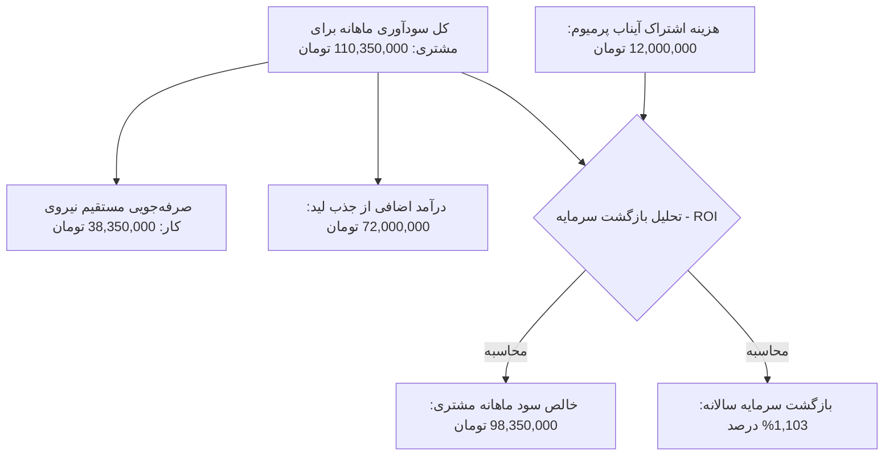

# 💎 سند جامع استراتژی قیمت‌گذاری ارزش‌محور آیناب (Ainaab Pricing Strategy)
### ارزان‌سازی خدمات، نه ارزان‌فروشی | نسخه ۱.۰ | مصوب ژوئن ۲۰۲۶

---

## ۱. فلسفه قیمت‌گذاری آیناب (The Aynab Pricing Philosophy)

هسته اصلی استراتژی تجاری اکوسیستم هوشک (Hoshak) بر این اصل استوار است: **«ما معتقد به ارزان‌فروشی نیستم، بلکه معتقد به ارزان‌سازی خدمات هستیم.»**

* **ارزان‌فروشی (Underpricing):** ارزش محصول را در ذهن مشتری پایین می‌آورد، حاشیه سود را نابود می‌کند و مانع رشد و توسعه کیفی پلتفرم می‌شود.
* **ارزان‌سازی خدمات (Cost-reduction & Dematerialization):** یعنی استفاده از خلاقیت‌های فنی، خودکارسازی فرآیندها، معماری هوشمند زنجیره مدل‌ها (مانند استفاده اولویت‌بندی شده از Gemini 2.0 و فالبک‌های بومی ایران) و حذف واسطه‌ها، به طوری که هزینه تمام‌شده ارائه سرویس (COGS) به حداقل ممکن برسد، اما ارزش ارائه‌شده به مشتری در بالاترین سطح باقی بماند.

قیمت‌گذاری آیناب مبتنی بر **ارزش خلق‌شده (Value-Based Pricing)** است. وقتی چت‌بات آیناب می‌تواند ماهانه ده‌ها میلیون تومان صرفه‌جویی در حقوق پرسنل ایجاد کند و به طور همزمان با پاسخ‌گویی ۲۴ ساعته و سریع، درآمد حاصل از جذب لید را تا ۳۰٪ افزایش دهد، قیمت‌گذاری آن باید متناسب با این ارزش عظیم خلق‌شده باشد، نه صرفاً بر اساس هزینه‌های فنی ناچیز آن.

---

## ۲. تحلیل بازار ایران و بنچ‌مارک رقبا (Competitive Benchmarking)

با بررسی بازار ایران و پلتفرم‌های ارائه‌دهنده چت‌بات پشتیبانی (مانند **گیپفای - Gipify**، موچت، رای‌چت و غیره)، ساختار تعرفه‌ها معمولاً بر اساس تعداد پاسخ‌ها، تعداد اپراتورها و کانال‌های ارتباطی محدود می‌شود:

### تحلیل مدل قیمت‌گذاری گیپفای (Gipify)
گیپفای به عنوان یکی از رقبای فعال، پلن‌های زیر را ارائه می‌دهد:
1. **پلن آغازین (Starter):** رایگان | ۱۰۰ پاسخ ماهانه | ۲ کارشناس | صرفاً وب‌سایت.
2. **پلن رشد (Growth):** ۱,۵۱۹,۰۰۰ تومان در ماه | ۱,۵۰۰ پاسخ ماهانه (۹۹۰ تومان به ازای هر پاسخ اضافه) | ۵ کارشناس | اتصال به تلگرام و اینستاگرام.
3. **پلن تجاری (Business):** ۱۲,۳۴۹,۰۰۰ تومان در ماه | ۱۵,۰۰۰ پاسخ ماهانه (۸۹۰ تومان به ازای هر پاسخ اضافه) | ۲۰ کارشناس | دسترسی کامل به کانال‌ها و حذف برند.
4. **پلن سازمانی (Enterprise):** قیمت توافقی و اختصاصی.

#### نقاط ضعف مدل رقبا (فرصت برای آیناب):
* **تله حجم پاسخ پایین (Overage Trap):** پلن ۱.۵ میلیون تومانی گیپفای فقط شامل ۱,۵۰۰ پاسخ در ماه (حدود ۵۰ پاسخ در روز) است. هر فروشگاه متوسطی به سرعت این سقف را رد کرده و مجبور می‌شود هزینه سرساز‌آوری بابت پاسخ‌های اضافی (۹۹۰ تومان به ازای هر پیام) پرداخت کند. به عنوان مثال، اگر مشتری مانند لیاتیم ۲,۴۰۰ پیام در ماه دریافت کند، در پلن رشد گیپفای باید مجموعاً حدود **۲.۴ میلیون تومان** پرداخت کند.
* **جهش قیمتی بسیار شدید:** جهش از ۱.۵ میلیون تومان به ۱۲.۳ میلیون تومان در گیپفای بسیار بزرگ است و کسب‌وکارهای در حال رشد را در بلاتکلیفی قرار می‌دهد.
* **نبود هوش مصنوعی آموزش‌دیده عمیق (RAG اختصاصی):** اکثر رقبا چت‌بات‌های فرمول‌نویسی شده یا ساده ارائه می‌دهند و راه‌اندازی RAG اختصاصی روی کاتالوگ‌های بزرگ و پیچیده (مثل محصولات تراست لیاتیم) نیاز به دانش فنی بالایی دارد که به صورت خودکار ارائه نمی‌شود.

---

## ۳. مدل قیمت‌گذاری پیشنهادی آیناب (Ainaab Pricing Model)

مدل قیمت‌گذاری آیناب شامل دو بخش اصلی است: **۱. هزینه راه‌اندازی و آموزش اولیه (یک‌بار پرداخت)** و **۲. اشتراک ماهانه ارزش‌محور (ماهانه)**. 

همچنین به دلیل پیوند عمیق با **«طرح ملی نخلستان معنا»**، بخشی از این درآمد مستقیماً به کاشت درختان خرما اختصاص می‌یابد که خود یک مزیت برندینگ مسئولیت اجتماعی (CSR) برای مشتریان است.

### ۳.۱. هزینه راه‌اندازی اولیه و آموزش اختصاصی (One-time Setup & Training Fee)
برخلاف پلتفرم‌های عمومی که فقط یک قطعه کد به مشتری می‌دهند، آیناب یک راهکار کاملاً سفارشی‌شده بر اساس کاتالوگ محصولات، داده‌های پشتیبانی و اهداف فروش مشتری ارائه می‌دهد.
* **پلان نوپا:** ۳,۰۰۰,۰۰۰ تومان (یک‌بار پرداخت)
* **پلان رشد:** ۶,۰۰۰,۰۰۰ تومان (یک‌بار پرداخت)
* **پلان پیشرفته:** ۱۲,۰۰۰,۰۰۰ تومان (یک‌بار پرداخت)
* **پلان سازمانی:** از ۳۰,۰۰۰,۰۰۰ تومان به بالا (بر اساس پیچیدگی ادغام سیستم‌ها)

> [!TIP]
> این هزینه شامل: سندسازی و پاک‌سازی داده‌های مشتری، ایجاد بردارها (Embeddings)، تست‌های تضمین کیفیت پاسخ‌دهی هوش مصنوعی و هماهنگ‌سازی با سیستم‌های CRM مشتری است.

---

### ۳.۲. پلان‌های اشتراک ماهانه آیناب (Subscription Tiers)

پلان‌های اشتراک ماهانه آیناب به گونه‌ای طراحی شده‌اند که ضمن ارائه حجم بسیار منصفانه‌تر و واقعی‌تر از پاسخ‌ها نسبت به رقبا، حاشیه سود و ارزش واقعی کار را حفظ کنند:

| ویژگی / پلان | 🌱 آیناب آغازین (Startup) | 🚀 آیناب رشد (Growth) | 💎 آیناب پیشرفته (Premium) | 👑 آیناب سازمانی (Enterprise) |
| :--- | :---: | :---: | :---: | :---: |
| **مناسب برای** | کسب‌وکارهای محلی و نوپا | فروشگاه‌های اینترنتی متوسط | برندها و هلدینگ‌های بزرگ (مانند لیاتیم) | سازمان‌ها و پرتال‌های بزرگ دولتی/خصوصی |
| **هزینه اشتراک ماهانه** | **۲,۵۰۰,۰۰۰ تومان** | **۵,۵۰۰,۰۰۰ تومان** | **۱۲,۰۰۰,۰۰۰ تومان** | **قیمت توافقی (شروع از ۲۵ میلیون)** |
| **تعداد پاسخ هوشمند ماهانه** | ۳,۰۰۰ پاسخ | ۱۰,۰۰۰ پاسخ | ۳۰,۰۰۰ پاسخ | نامحدود (میزبانی اختصاصی) |
| **هزینه هر پاسخ اضافه** | ۴۰۰ تومان | ۳۰۰ تومان | ۲۰۰ تومان | بر اساس توافق |
| **کارشناس ناظر (اپراتور)** | ۱ کارشناس | تا ۳ کارشناس | تا ۱۰ کارشناس | نامحدود |
| **ظرفیت پایگاه دانش (RAG)** | تا ۵۰ محصول / فایل | تا ۱,۵۰۰ محصول / فایل | تا ۱۰,۰۰۰ محصول / فایل | نامحدود + دیتابیس اختصاصی |
| **کانال‌های ارتباطی** | فقط ویجت وب‌سایت | وب‌سایت + تلگرام + بله | وب‌سایت + تلگرام + بله + اینستاگرام | تمام کانال‌ها + اتصال به اپلیکیشن اختصاصی |
| **مکانیزم پایداری (Failover)** | زنجیره استاندارد LLM | زنجیره پیشرفته با ۲ فالبک بومی | زنجیره کامل با ۴ لایه فالبک و Circuit Breaker زنده | سرور مجزا (VPS ایران) + Active-Active Sync |
| **حذف برند آیناب** | ❌ ندارد | ❌ ندارد | ✅ دارد (وایت لیبل کامل) | ✅ دارد |
| **پشتیبانی** | تیکت و چت آنلاین | گروه تلگرام (پاسخ‌گویی زیر ۴ ساعت) | گروه اختصاصی (پاسخ‌گویی زیر ۱ ساعت) | مدیر اکانت اختصاصی و پشتیبانی ۲۴ ساعته |
| **مشارکت در نخلستان معنا** | سالانه ۱ نخل شناسنامه‌دار | سالانه ۳ نخل شناسنامه‌دار | سالانه ۸ نخل شناسنامه‌دار | سالانه ۲۰+ نخل شناسنامه‌دار |

---

## ۴. توجیه مالی و بازگشت سرمایه (ROI Analysis) برای پلان پیشرفته (مثال: لیاتیم)

بیایید نشان دهیم چطور پلان پیشرفته آیناب با هزینه **۱۲ میلیون تومان در ماه**، برای مشتری کاملاً اقتصادی و توجیه‌پذیر است:

### فرمول اثبات ارزش به مشتری در جلسات فروش:
1. **پوشش سریع هزینه‌ها:** فقط با **۶ سفارش موفق اضافه در ماه** (با میانگین ۲ میلیون تومان)، کل هزینه اشتراک ماهانه ۱۲ میلیون تومانی آیناب پرمیوم جبران می‌شود. بقیه درآمدها و صرفه‌جویی در حقوق، سود خالص مشتری است.
2. **صرفه‌جویی خالص در پشتیبانی:** بدون احتساب افزایش فروش، مشتری به جای پرداخت **۵۵,۳۵۰,۰۰۰ تومان** هزینه تیم پشتیبانی ۳ نفره، مجموعاً **۲۷,۰۰۰,۰۰۰ تومان** (شامل ۱۵ میلیون تومان حقوق ۱ کارشناس ناظر باقی‌مانده + ۱۲ میلیون تومان اشتراک پرمیوم) پرداخت می‌کند. این یعنی **۲۸,۳۵۰,۰۰۰ تومان صرفه‌جویی خالص نقدی در ماه** از همان روز اول!

---

## ۵. استراتژی بازاریابی مبتنی بر مسئولیت اجتماعی (Nakhlestan-Aligned Sales Pitch)

یکی از وجوه تمایز بزرگ آیناب، تخصیص ۷۰٪ سود برای پروژه **نخلستان معنا** در استان بوشهر است. این ویژگی به ما اجازه می‌دهد در فرآیند فروش به صورت زیر اقدام کنیم:

* **ارائه سند دیجیتال نخل:** به محض شروع همکاری و پرداخت هزینه راه‌اندازی، سندی دیجیتال با مختصات جغرافیایی (GPS) دقیق نخل‌های کاشته شده به نام برند مشتری صادر می‌شود.
* **کمپین مشترک روابط عمومی (PR):** ما به مشتری ابزارهایی می‌دهیم تا در وب‌سایت خود اعلام کند: *"به ازای هر خرید شما از ما، بخشی از هزینه آن توسط سیستم هوشمند آیناب صرف کاشت و نگهداری نخلستان‌های جنوب کشور می‌شود."* این کار وفاداری مشتریان نهایی آن‌ها را به شدت بالا می‌برد.

---

## ۶. ضمانت بازگشت وجه — سپر اعتماد مشتریان جدید (Money-Back Guarantee)

> [!IMPORTANT]
> ضمانت بازگشت وجه نه یک هزینه، بلکه **قوی‌ترین ابزار فروش** ماست. وقتی ما با اطمینان کامل پشت محصولمان می‌ایستیم و ریسک مالی را از شانه‌های مشتری برمی‌داریم، پیام ما واضح است: **«ما به ارزشی که خلق می‌کنیم ایمان داریم.»**

### ۶.۱. چرا ضمانت بازگشت وجه ضروری است؟

در بازار B2B ایران، اعتماد بزرگ‌ترین مانع فروش است. مشتریان بالقوه — مخصوصاً آن‌هایی که برای **اولین بار** از خدمات هوش مصنوعی استفاده می‌کنند — سه ترس اساسی دارند:

1. **ترس از عملکرد ناکافی:** «آیا چت‌بات واقعاً جواب درست می‌دهد یا آبروی برندم را می‌برد؟»
2. **ترس از هزینه بی‌بازگشت:** «اگر نتیجه نداد، پولم سوخته؟»
3. **ترس از پیچیدگی:** «اگر نتوانستم از آن استفاده کنم چه؟»

ضمانت بازگشت وجه هر سه ترس را همزمان خنثی می‌کند و مشتری مردد را به مشتری فعال تبدیل می‌کند.

### ۶.۲. ساختار ضمانت بازگشت وجه آیناب

ضمانت آیناب شامل **دو لایه** است که هر کدام دوره و شرایط مشخصی دارند:

---

#### 🛡️ لایه اول: ضمانت ۳۰ روزه بدون قید و شرط (هزینه راه‌اندازی)

| جزئیات | شرح |
| :--- | :--- |
| **مدت ضمانت** | ۳۰ روز تقویمی از تاریخ تحویل نهایی و فعال‌سازی چت‌بات |
| **شامل** | کل هزینه راه‌اندازی اولیه (Setup Fee) |
| **شرایط** | **بدون قید و شرط** — مشتری به هر دلیلی می‌تواند انصراف دهد |
| **فرآیند بازگشت** | درخواست کتبی (ایمیل یا پیام) → بازگشت وجه ظرف ۷ روز کاری |
| **محدودیت** | فقط برای **مشتریان جدید** (اولین قرارداد با آیناب) |

> [!NOTE]
> **پیام فروش:** *«اگر ظرف ۳۰ روز اول از کیفیت کار ما راضی نبودید — به هر دلیلی — تمام هزینه راه‌اندازی را بدون هیچ سؤالی بازمی‌گردانیم. ما به ارزشی که خلق می‌کنیم ایمان داریم.»*

---

#### 📊 لایه دوم: ضمانت ۶۰ روزه عملکردی (اشتراک ماهانه)

این لایه مبتنی بر **شاخص‌های کلیدی عملکرد (KPI)** است. اگر چت‌بات آیناب در ۶۰ روز اول نتواند حداقل یکی از معیارهای زیر را محقق کند، مشتری حق درخواست بازگشت کامل حق اشتراک ماه‌های پرداختی را دارد:

| شاخص عملکردی (KPI) | حداقل تعهد آیناب | نحوه اندازه‌گیری |
| :--- | :---: | :--- |
| **نرخ پاسخ‌گویی موفق** | ≥ ۸۵٪ پاسخ‌های صحیح و مرتبط | بازبینی نمونه‌ای توسط تیم مشتری و تیم آیناب |
| **زمان پاسخ‌دهی** | ≤ ۵ ثانیه (میانگین) | لاگ‌های خودکار سیستم (`chatbot_logs`) |
| **آپتایم (در دسترس بودن)** | ≥ ۹۹٪ | مانیتورینگ خودکار سلامت سرویس |
| **ثبت لید (Lead Capture)** | حداقل ۱ لید معتبر در هفته | داده‌های ثبت‌شده در جدول `leads` |

| جزئیات | شرح |
| :--- | :--- |
| **مدت ضمانت** | ۶۰ روز تقویمی از تاریخ فعال‌سازی |
| **شامل** | کل مبلغ اشتراک ماهانه پرداخت‌شده (حداکثر ۲ ماه) |
| **شرایط** | عدم تحقق حداقل **یکی** از KPIهای جدول فوق |
| **فرآیند** | ارائه گزارش عملکرد ← بررسی مشترک ← بازگشت وجه ظرف ۱۰ روز کاری |
| **محدودیت** | فقط برای **مشتریان جدید** (اولین قرارداد با آیناب) |

> [!TIP]
> **چرا ۶۰ روز؟** تجربه نشان می‌دهد ۳۰ روز برای یادگیری سازمانی و تطبیق کارکنان مشتری با سیستم جدید کافی نیست. ۶۰ روز فرصت واقعی و منصفانه‌ای به هر دو طرف می‌دهد تا نتایج ملموس ظاهر شود.

---

### ۶.۳. تحلیل استراتژیک ریسک ضمانت

آیا این ضمانت ریسک مالی بزرگی برای ما ایجاد می‌کند؟ **خیر.** به دلایل زیر:

1. **اعتماد فنی:** معماری Circuit Breaker و زنجیره ۴ لایه فالبک، آپتایم بالای ۹۹٪ را عملاً تضمین می‌کند. ما به ندرت با مشکل فنی پایدار مواجه می‌شویم.
2. **کیفیت RAG:** چت‌بات‌های ما روی داده‌های واقعی مشتری آموزش می‌بینند و قبل از تحویل، فرآیند تست کیفیت (QA) طی می‌شود.
3. **اثر روانشناختی معکوس:** تحقیقات نشان می‌دهد ضمانت بازگشت وجه، نرخ درخواست استرداد واقعی را **کاهش** می‌دهد (نه افزایش)، زیرا مشتری احساس امنیت کرده و تعهد بیشتری نسبت به یادگیری و استفاده صحیح از محصول نشان می‌دهد.
4. **فیلتر مشتری جدی:** وجود KPIهای شفاف در لایه دوم، مانع سوءاستفاده شده و فقط مشتریانی که واقعاً نتیجه نگرفته‌اند را پوشش می‌دهد.

> [!CAUTION]
> **قانون حیاتی:** ضمانت بازگشت وجه **فقط برای مشتریان جدید** (اولین قرارداد) اعمال می‌شود. مشتریانی که قرارداد خود را تمدید می‌کنند یا پلان ارتقا می‌دهند، دیگر شامل این ضمانت نمی‌شوند، زیرا تمدید خود گواه رضایت و اثبات ارزش است.

### ۶.۴. نحوه ارائه ضمانت در فرآیند فروش

در هر پروپوزال و جلسه فروش، ضمانت بازگشت وجه باید **برجسته و واضح** ارائه شود — نه به عنوان یک شرط حقوقی کوچک در پاورقی، بلکه به عنوان **یک مزیت رقابتی کلیدی:**

*«ما آنقدر به ارزشی که برای کسب‌وکار شما خلق می‌کنیم اطمینان داریم که تمام ریسک مالی را خودمان می‌پذیریم. اگر در ۳۰ روز اول از هزینه راه‌اندازی و در ۶۰ روز اول از عملکرد سرویس رضایت نداشتید، هزینه‌های شما بدون هیچ دردسری بازگردانده می‌شود. شما فقط زمانی پرداخت می‌کنید که ارزش واقعی دریافت کرده باشید.»*

---

## ۷. اقدامات اجرایی بعدی (Action Items)

1. **به‌روزرسانی ماشین‌حساب لندینگ (`index.html`):**
   * تغییر مقدار ثابت `aiSubscription` در تابع `calculate()` از ۲,۰۰۰,۰۰۰ تومان به **۱۲,۰۰۰,۰۰۰ تومان** (مطابق پلان پرمیوم که مناسب حجم کاری لیاتیم است).
   * به‌روزرسانی متون و قیمت‌های استاتیک در لندینگ پیج جهت هماهنگی با تعرفه‌های جدید.
2. **طراحی بخش تعرفه‌ها (Pricing Tables) در لندینگ:**
   * پیاده‌سازی جدول تعرفه‌های فوق به صورت کاملاً تعاملی و زیبا با Vanilla CSS در بخش زیرین ماشین حساب.
3. **تدوین پروپوزال‌های اختصاصی B2B:**
   * استفاده از این سند به عنوان ساختار اصلی در نگارش پروپوزال برای مشتریان جدید هلدینگ هوشک.
4. **درج ضمانت بازگشت وجه در لندینگ و پروپوزال‌ها:**
   * طراحی بنر یا بخش بصری مجزا در لندینگ با آیکون سپر (🛡️) و متن ضمانت.
   * اضافه کردن بند ضمانت به قالب استاندارد قراردادهای B2B.
